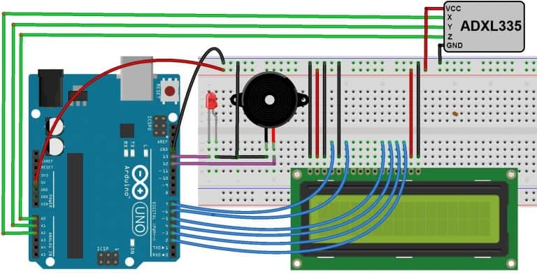
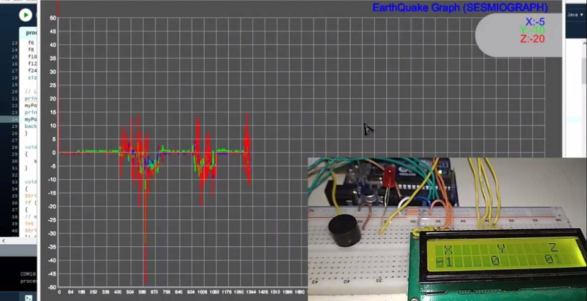

# Arduino Earthquake Detector Alarm with Seismic Graph using Accelerometer

## Introduction:
In this project, we will learn how to design Arduino Earthquake Detector Alarm with Seismic Graph. We have used ADXL335 3 axis Accelerometer as a sensor for detecting tilting, trembling, or any shaking movement of an earthquake. We have an interfaced ADXL335 Accelerometer with Arduino and LCD display for designing Arduino Earthquake Detector Alarm with Seismic GraphThe Arduino code, as well as processing IDE code both, are given below. The processing IDE code helps in drawing the graph of the tilting state. The buzzer or LED is used as an alarm whenever the shaking threshold goes higher.

## ADXL335 3 Axis Accelerometer:
### Introduction:

This Accelerometer module is based on the popular ADXL335 three-axis analog accelerometer IC, which reads off the X, Y, and Z acceleration as analog voltages. By measuring the amount of acceleration due to gravity, an accelerometer can figure out the angle it is tilted at with respect to the earth. By sensing the amount of dynamic acceleration, the accelerometer can find out how fast and in what direction the device is moving. Using these two properties, you can make all sorts of cool projects, from musical instruments (imagine playing and having the tilt connected to the distortion level or the pitch-bend) to a velocity monitor on your car (or your children’s car). The accelerometer is very easy to interface to an Arduino Micro-controller using 3 analog input pins and can be used with most other microcontrollers, such as the PIC or AVR.

### Features:
3V-6V DC Supply Voltage
Onboard LDO Voltage regulator
It can be interface with 3V3 or 5V Microcontroller.
All necessary Components are populated.
Ultra-Low Power: 40uA in measurement mode, 0.1uA in standby@ 2.5V
Tap/Double Tap Detection
Free-Fall Detection
Analog output

### Working of ADXL335 Accelerometer:
The most commonly used device is the piezoelectric accelerometer. As the name suggests, it uses the principle of piezoelectric effect. The device consists of a piezoelectric quartz crystal on which an accelerative force, whose value is to be measured, is applied.

Due to the special self-generating property, the crystal produces a voltage that is proportional to the accelerative force. The working and the basic arrangement is shown in the figure below.

## Components Required:
Arduino Uno Board
ADXL335 Accelerometer
16 x 2 LCD Display
Buzzer
LED

## Circuit Diagram & Connections:

Arduino Earthquake Detector Accelerometer
### Working Explanation:
In this Arduino Earthquake Detector Alarm with Seismic Graph project, we have made two codes: one for Arduino to detect an earthquake and another for Processing IDE to plot the earthquake vibrations over the graph on Computer.

First, upload the Arduino Code/program to the Arduino UNO board. After that open processing IDE. Copy the code from below and paste it on IDE. Then the next step is hit on the run. As soon as you hit run the graph starts running. So shake the accelerometer and observe the graph.
